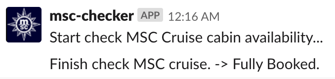
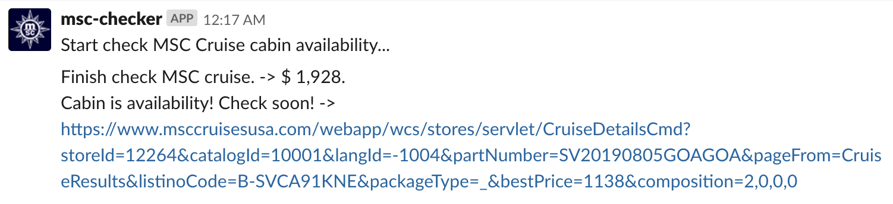

# MSC Cruise cabin availability checker

This is a Hubot to check MSC Cruise cabin availability.
You can find out the availability of cabins on a cruise.

### Screenshot

<kbd></kbd>

<kbd></kbd>

### Running Locally

Setup

```
$ npm install
```

You can start hubot locally by running:

```
$ bin/hubot
```

### Configuration

You can modify following code directly.


```javascript:scripts/index.js
// SELECT YOUR CRUISE DETAILs URL
const cruiseDetailsUrl = 'https://www.msccruisesusa.com/webapp/wcs/stores/servlet/CruiseDetailsCmd?storeId=12264&catalogId=10001&langId=-1004&partNumber=SV20190805GOAGOA&pageFrom=CruiseResults&listinoCode=B-SVCA91KNE&packageType=_&bestPrice=1138&composition=2,0,0,0';
```

```javascript:scripts/index.js
.wait('.tab-price-cat-YC1-1-10')
.evaluate(() => {
  return document.querySelector('.tab-price-cat-YC1-1-10 .cs-price').innerText;
})
```

* cruiseDetailsUrl  
You can searh MSC Cruise detail.  
https://www.msccruisesusa.com/en-us/Homepage.aspx
* cabinType  
following value avalilable.
    * tab-price-cat-YIN-1-9  
    MSC YACHT CLUB INTERIOR SUITE
    * tab-price-cat-YC1-1-10  
    MSC YACHT CLUB DELUXE SUITE
    * tab-price-cat-YC3-1-11  
    MSC YACHT CLUB ROYAL SUITE
    * tab-price-cat-INS-1-0  
    INSIDE
    * tab-price-cat-OUT-1-1  
    OCEAN VIEW
    * tab-price-cat-OUB-1-2  
    BALCONY
    * tab-price-cat-SUI-1-3  
    SUITE
    * tab-price-cat-SEW-1-4  
    GEAND SUITE
    * tab-price-cat-SJ3-1-5  
    SUITE WITH WHITEPOOL TAB
    * tab-price-cat-SD3-1-6  
    TWO-BEDROOM GRAND SUITE
    * tab-price-cat-FLA-1-7  
    SUPER FAMILY
    * tab-price-cat-FLP-1-8  
    SUPER FAMILY PLUS

### Other

I'd like to book MSC YACHT CLUB DELUXE SUITE... But the cabin is not availability now.  
Help me Help Others.
